summary: Animations
id: react-native-animations
categories: Animation
tags: rn
status: Published 
authors: Artur Kalach
Feedback Link: artur_kalach@epam.com

# Animations
<!-- ------------------------ -->
## Обзор
Duration: 2
1. LayoutAnimation
2. Animated
3. Animation Performance & 3rd party libraries

### Наш план
- how to use LayoutAnimation
- how to create animation by Animated API
- how to improve Animation Performance
- how to differents ways to animate
- how to create animation with RN-Reanimated and RN-guesture-handler
- other stuff

<!-- ------------------------ -->
## LayoutAnimation API
Duration: 

`LayoutAnimation API` позволяет глобально анимироать для всех компонентов в следующем цикле рендеринга макета.
Автоматически анимирует все Views к их новым позициям когда происходит "перерисовка" layout.

 Для работы на Android будет необходимо поставить флаг в `UIManager`:
```javascript
if (Platform.OS === 'android') {
  if (UIManager.setLayoutAnimationEnabledExperimental) {
    UIManager.setLayoutAnimationEnabledExperimental(true);
  }
}
```

Чтобы запустить анимацию достаточно вызвать `LayoutAnimation API` перед тем как мы используем `setState`

```javascript
    onPress(index) {
         LayoutAnimation.spring();
         setWidth(width + 15)
    }

```


| Without   | With |
| ----------- | ----------- |
| 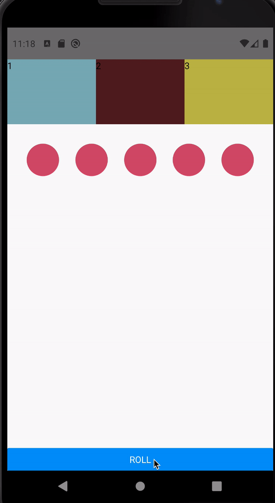   | 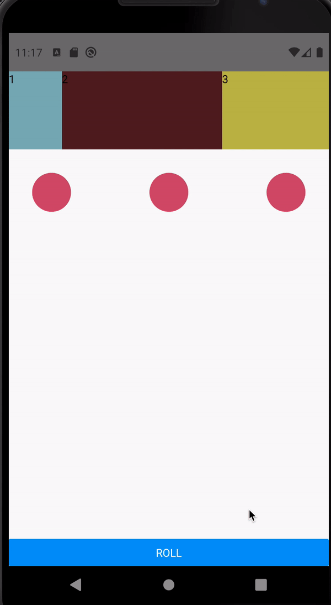    |


`LayoutAnimation` предоставляет два метода `configureNext()` и `create()` а так-же предоставляются алиасы `easeInEaseOut`, `spring` и `linear` которые вызывают `configureNext` с заданой настройкой.
Ниже приведены графики функций:
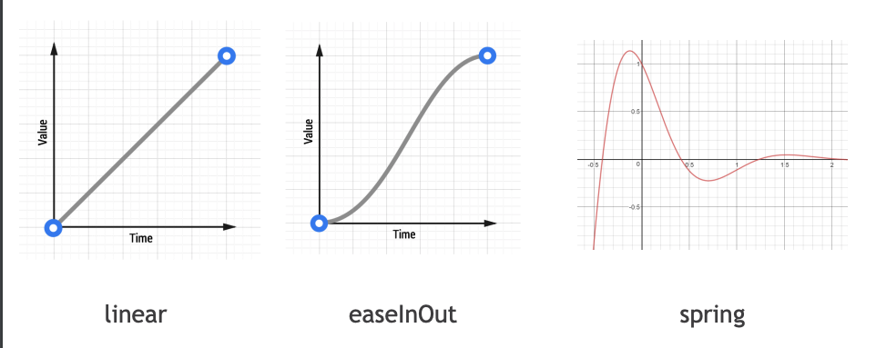 

`configureNext(config, onAnimationDidEnd?)` функция которая 'планирует' анимацию на следующий layout. `create(duration, type, creationProp)` вспомогательная функция для создания настроек к `configureNext`.

На изображении ниже отображены настройка "базовых" анимаций.

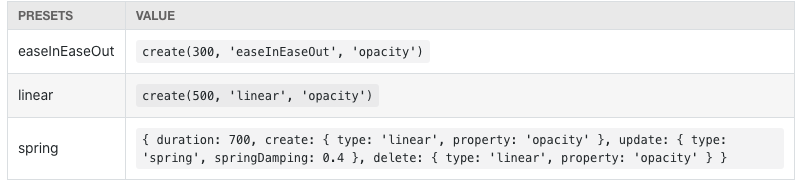  

Еще два примера. В обоих используется изменение размеров:

|  Spring  | Liner |
| ----------- | ----------- |
| 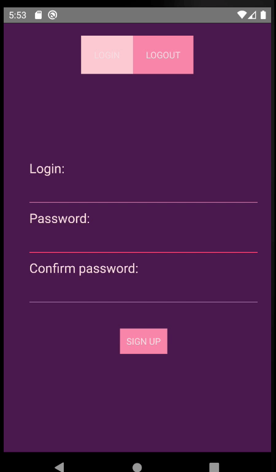   | 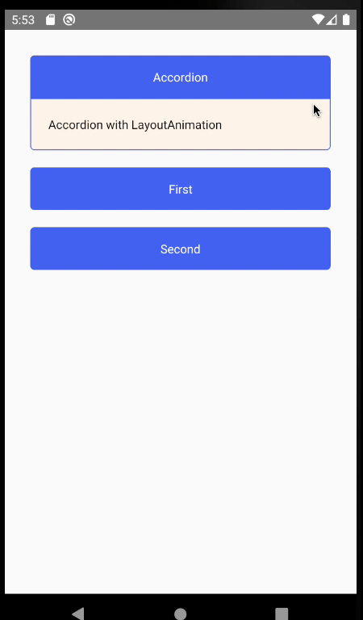    |

: Важное примечание: однажды запустив анимацию, мы не сможем ее изменить или остановить.

### Итог
Positive
: LayoutAnimation анимация довольна проста в испольозовании и имеет хорошую проихводительность.

Negative
: Работает только со свойствами разметки, непрерывная

Ссылка на официальную документацию: [LayoutAnimation](https://reactnative.dev/docs/layoutanimation)


<!-- ------------------------ -->
## Animated API
Duration: 8

`Animated` является основным способом анимации в `React Native`. Библиотека `Animated` разработана чтобы сделать анимацию плавной, можной и простой в создании и поддержке.
В отличии от `LayoutAnimation`, она позволяет манипулировать над конкретными свойствами React компонента.

В данной библеотке можно различить три основных базовых эллементов:

1. Анимированное значение `Animated.Value`
2. Конфигурацию `Configuring animations| Animation Methods` или методы - при помощи которой можно запустить анимацию
3. Компонент Анимации `Animated components` - React компонент свойства которого будут анимированы


### Animated components

`Animated API` предоставляет следующие компоненты для анимации
 
- `Animated.Image`
- `Animated.ScrollView`
- `Animated.Text`
- `Animated.View`
- `Animated.FlatList`
- `Animated.SectionList`

А также позволяет создать собственный при помощи `Animated.createAnimatedComponent`.

```javascript
    import { Path, Rect } from "react-native-svg";
    ...
    const AnimatedRect = Animated.createAnimatedComponent(Rect)
    const AnimatedRect = Animated.createAnimatedComponent(Rect)
```


### Animated values

`Animated values` - значение которое будет изменяться при помощи `Animation methods` для `Animation component`.

```javascript
    const anim = useRef(new Animated.Value(0)).current 
```


- `Anumated.Value()` - для одного значения
- `Animated.ValueXY()` - для вектора
  
Два значения могут быть объединены при помощи:

- `Anumated.add()`
- `Animated.divide()`
- `Animated.modulo()`
- `Animated.multiply()`

```javascript
    const a = useRef(new Animated.Value(0)).current 
    const b = useRef(new Animated.Value(0)).current 
    const c = Animated.add(a,b)
```

### Animation methods

-  `Animated.timimng()`
-  `Animated.decay()`
-  `Animated.spring()`


```javascript
    Animated.timing(xPosition, {
        toValue: 100,
        easing: Easing.back(),
        duration: 2000
    }).start();
```

Composing animations

- `Animated.delay()`
- `Animated.parallel()`
- `Animated.sequence()`
- `Animated.stagger()`

```javascript
    Animated.sequence([
        Animated.decay(position, {
            velocity: { x: gestureState.vx, y: gestureState.vy },
            deceleration: 0.997
        }),
        Animated.parallel([
            Animated.spring(position, {
                toValue: { x: 0, y: 0 } 
            }),
            Animated.timing(twirl, {
                toValue: 360
            })
        ])
    ]).start();
```


### Interpolation

```javascript
value.interpolate({
  inputRange: [0, 1],
  outputRange: [0, 100] // 0 : 0, 0.5 : 50, 1 : 100
});
```

### Handling gestures and other events 


`Event`

Значение `new Animated.Value(arg)` является объектом представленным классом `AnimatedValue`

```javascript
    AnimatedValue {_listeners: {…}, _children: Array(0), _value: 25, _startingValue: 25, _offset: 0, …}
        _animation: null
        _children: (2) [AnimatedStyle, AnimatedStyle]
        _listeners: {}
        _offset: 0
        _startingValue: 25
        _value: 25
        __proto__: AnimatedWithChildren
```

Значение переменной анимации можно изменить при помощи `Animated.event(argMapping, config?)`.

```javascript
    static event(argMapping, config?)
```

```
  const x = useRef(new Animated.Value(25)).current
  const xEvent = Animated.event([{x}], {useNativeDriver: false})
  const onPress = () => xEvent({x:10})

  ...

  <Button title="Roll" onPress={onPress}/>
```

В большинстве случаях мы используем `Animated.event` в связке с уже имеющиемися компонентами.
Чаще всего встречаются `onScroll` и `onPanResponderMove`. 


```javascript
    onScroll={Animated.event(
        [{nativeEvent: {contentOffset: {x: this._scrollX}}}],
        {listener: (event) => console.log(event)}, // Optional async listener
    )}
    ...
    onPanResponderMove: Animated.event([
        null,                // raw event arg ignored
        {dx: this._panX}],    // gestureState arg
        {listener: (event, gestureState) => console.log(event, gestureState)}, // Optional async listener
    ),
```

### Additional params

- useNativeDriver
- isInteraction


<!-- ------------------------ -->
## Animation Performance & 3rd party libraries
Duration: 10
### Performance

Различнают 3 "главных" потока в React Native:
- Shadow queue (layout): где обрабатывется разметка 
- Main thread(Main): где работает UIKit
- JavaScript(Biz Logic): где работает JS код

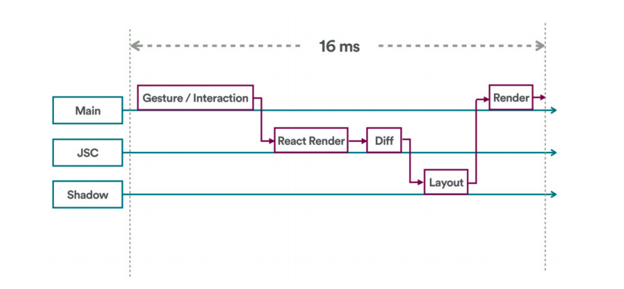  

Рассмотрим ситуацию:
На изображении ниже представлина линия времени анимация, каждый кадр изменяется со временем и пользователь видит качественную анимацию.
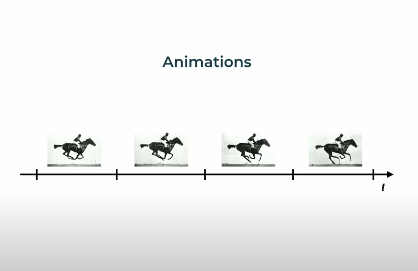

Тут отображен случай с пропуском кадра, и предыдущий фрейм отображается немного дольше
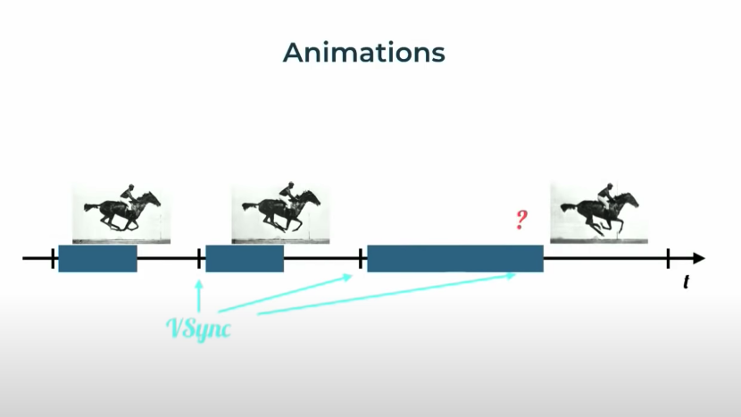

Рассмотрим пример с потоками.
Когда у нас есть анимация, у нас создается listener и предоставляется callback с UI thread для JS, чтобы JS мог обновить UI и необходимо обратно отправить инструкции к native части.
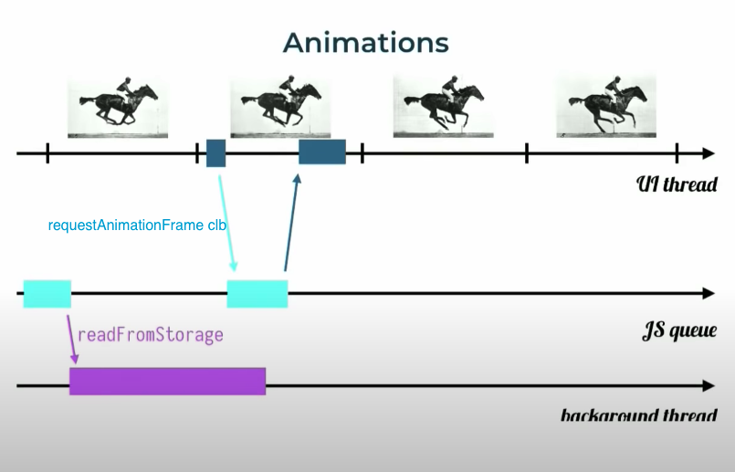

Но если очередь JS загружена, мы получаем `requestAnimationFrame` и кадр в UI thread не обновляется, а просто 'перемещается'
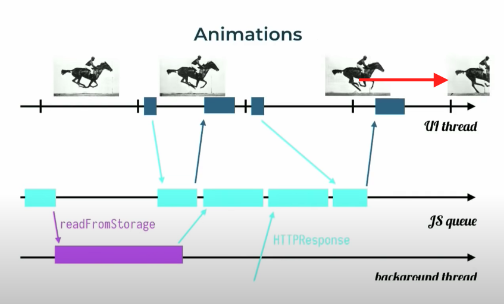

Немного об обработке жестов
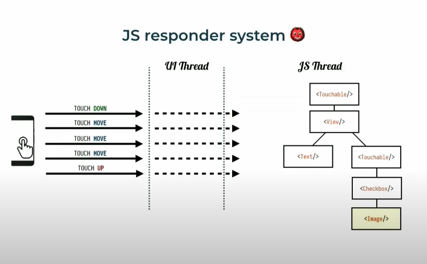

| Without   | With | Reanimated |
| ----------- | ----------- | ----------- |
| 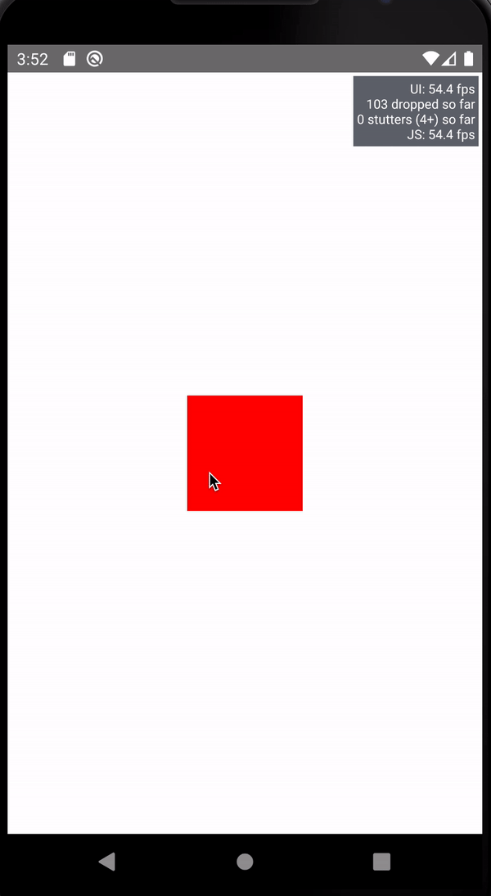   | 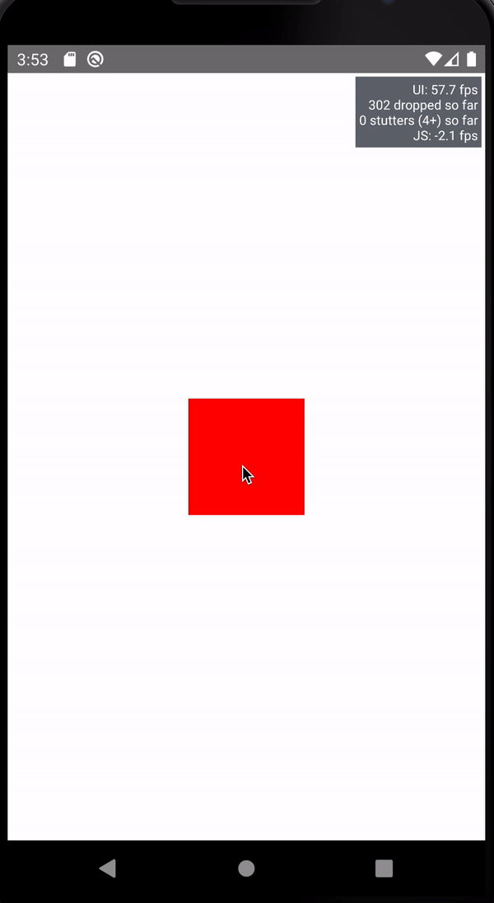    | 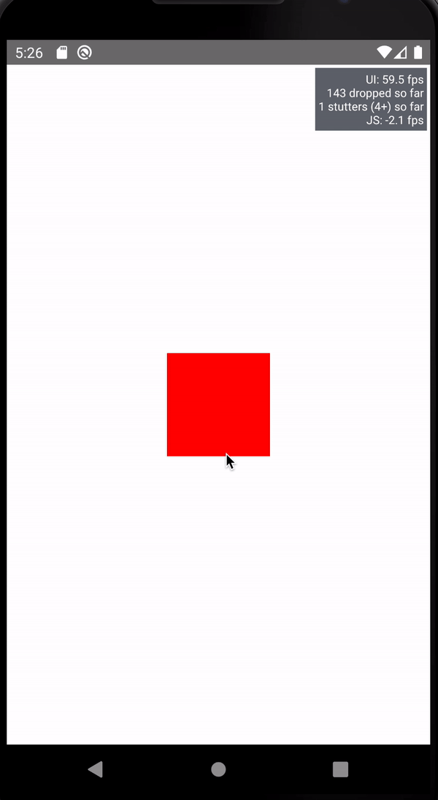|


Улучшаем производительность.
- react-native-reanimated
- react-native-gesture-handler
- react-native-redash


### 3rd party libraries

[react-native-spreadsheet](https://github.com/MiLeung/rn-sprite-sheet)


|   |  |
| ----------- | ----------- | 
|  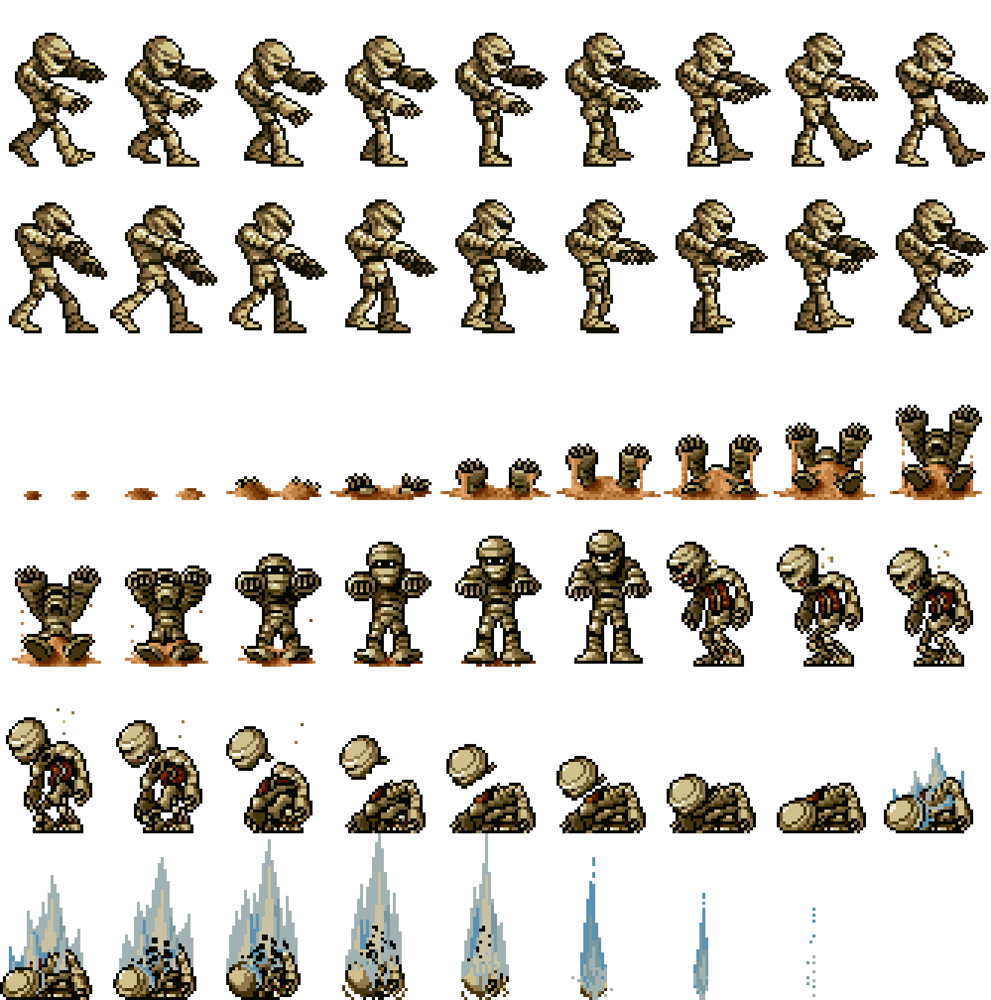 | 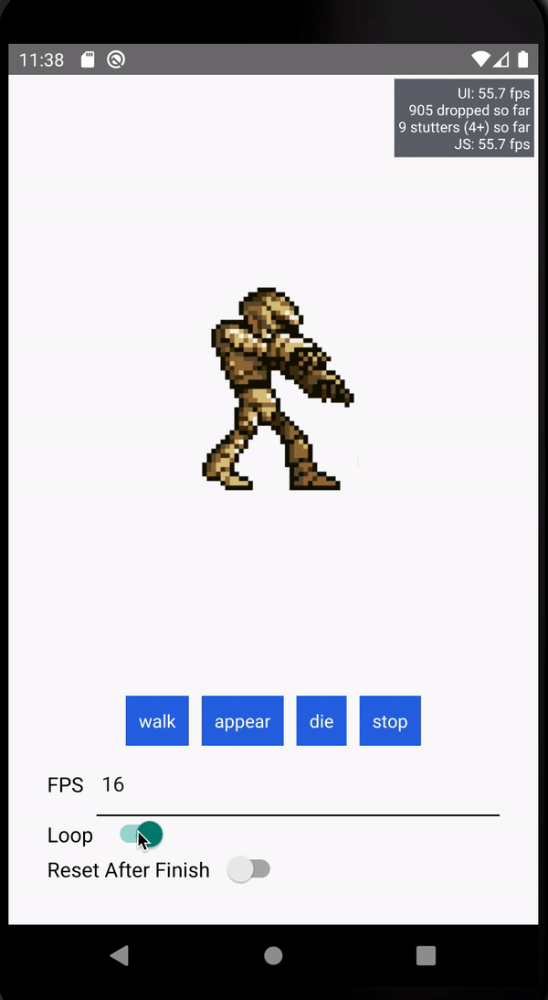 |


| Lottie  | Animatable |
| ----------- | ----------- | 
| [lottie-react-native](https://github.com/react-native-community/lottie-react-native) | [react-native-animatable](https://github.com/oblador/react-native-animatable) |
|  | 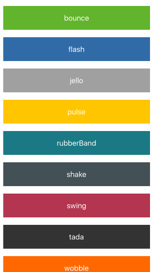 |

<!-- ------------------------ -->
## Other Stuff
Duration: 3


- Animating global layout transactions: LayoutAnimation
- Granular and interactive control: Animated
- Animation Performance
- 3rd party libraries

[RN animations](https://reactnative.dev/docs/animations)

[RN Animated API](https://reactnative.dev/docs/animated)

[RN Layoytaniimation API](https://reactnative.dev/docs/layoutanimation)

[RN Gesture Handler](https://github.com/software-mansion/react-native-gesture-handler)

[RN Reanimated](https://github.com/software-mansion/react-native-reanimated)

[RN Sprite-sheet](https://github.com/MiLeung/rn-sprite-sheet)

[RN Lottie](https://github.com/react-native-community/lottie-react-native)

[RB Animatable](https://github.com/oblador/react-native-animatable)

### Дополнительно

[Declarative future of gestures and animations in React Native](https://youtu.be/kdq4z2708VM)

[William Candillon](https://www.youtube.com/channel/UC806fwFWpiLQV5y-qifzHnA)
